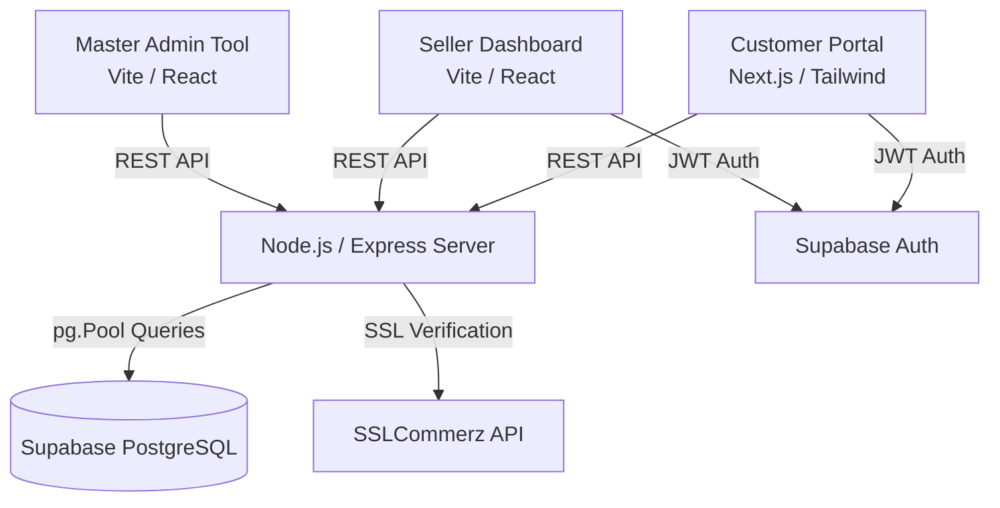

<div align="center">
  
  <h1>🛍️ FeriWala (ফেরিওয়ালা)</h1>
  <p><strong>A Full-Stack, Multi-Vendor E-Commerce Platform built for the Bangladeshi Market</strong></p>

  <!-- Tech Stack Badges -->
  
  
  
  
  
  
  
</div>

<br />

<div align="center">
  <h3>🚀 Live Demos</h3>
  <p>
    <a href="https://feriwala-client.vercel.app/" target="_blank">🛒 Customer Storefront</a> | 
    <a href="https://feriwala-seller.vercel.app/" target="_blank">🏪 Seller Dashboard</a> | 
    <a href="https://feriwala-admin.vercel.app/" target="_blank">🔐 Master Admin Tool</a>
  </p>
  <p><i>Backend API is running on Railway: <code>https://feriwala-full-stack-bangladeshi-e-commerce-platf-production.up.railway.app</code></i></p>
</div>

<br />

## 📖 Overview

FeriWala is a comprehensive, production-ready e-commerce solution designed to handle complex multi-vendor relationships. Built as a **monorepo containing four independent applications**, it demonstrates an advanced understanding of modern web architecture, secure authentication flows, and real-world payment integrations.

This project was built to solve the unique challenges of e-commerce in Bangladesh, featuring native support for local payment methods (bKash, Nagad), Bengali typography, and localized delivery logistics.

## ✨ Why This Project Stands Out

- **Complex Monorepo Architecture**: Manages a scalable Node.js/Express backend communicating with three separate React-based frontends (Customer, Seller, and Master Admin).
- **Real-World Payment Integration**: Successfully implements the **SSLCommerz** payment gateway API with secure webhook fallbacks and database transaction mapping.
- **Enterprise-Grade Security**: Features Helmet-hardened HTTP headers, strict CORS whitelisting, and stateless JWT authentication via Supabase Auth.
- **Optimized Data Layer**: Uses parameterized PostgreSQL queries with pg.Pool to prevent SQL injection and ensure high performance under load.
- **Premium UI/UX**: Custom design system built with Tailwind CSS, featuring staggered micro-animations, glassmorphism, and fully responsive layouts.

---

## 🏗️ System Architecture

The platform follows a decoupled architecture, allowing individual services to scale independently.



### 📁 Monorepo Structure

- `/client` **(Next.js)**: Server-side rendered storefront optimized for SEO and core web vitals.
- `/server` **(Node.js/Express)**: Robust REST API handling business logic, payment verification, and database interactions.
- `/seller` **(Vite/React)**: Client-side rendered dashboard for vendors to manage inventory, process orders, and view analytics.
- `/seller_admin` **(Vite/React)**: Internal admin tool for generating secure vendor registration tokens.

---

## 🚀 Deployment & Infrastructure

The application is fully containerized/configured for modern cloud hosting:

- **Backend (API)**: Deployed on **Railway** for long-running Node.js processes.
  > ⚠️ **Note on Image Uploads:** Railway uses ephemeral file storage, meaning images uploaded via Multer (local disk) will be lost upon subsequent redeploys. In the future, this will be migrated to **Supabase Storage** for persistent, cloud-based asset management.
- **Frontends (UI)**: Deployed globally on the **Vercel** Edge Network with custom SPA rewrite rules (`vercel.json`).
- **Database**: Hosted on **Supabase** (PostgreSQL).

<details>
<summary><b>Click to view local development setup</b></summary>

### Prerequisites
- Node.js >= 18
- A Supabase project (for DB and Auth)

### Setup
1. Clone the repository.
2. In all 4 directories (`server`, `client`, `seller`, `seller_admin`), copy the `.env.example` file to `.env` (or `.env.local` for Next.js) and fill in your Supabase credentials.
3. Install dependencies and start development servers:

**Terminal 1 (Backend)**
```bash
cd server
npm install
npm run dev # Runs on http://localhost:5000
```

**Terminal 2 (Customer Frontend)**
```bash
cd client
npm install
npm run dev # Runs on http://localhost:3000
```

**Terminal 3 (Seller Dashboard)**
```bash
cd seller
npm install
npm run dev # Runs on http://localhost:5173
```
</details>

---

## 🛡️ Security Highlights

- **Parameterized Queries**: All SQL interactions use prepared statements to completely mitigate SQL injection vectors.
- **CORS Protection**: The backend enforces a strict whitelist of allowed frontend origins via environment variables.
- **JWT Verification**: Custom Express middleware validates Supabase-issued JWTs before allowing access to protected routes.
- **Payment Verification**: Avoids client-side payment tampering by securely looking up order parameters in the database upon successful gateway redirects (`tran_id` verification).