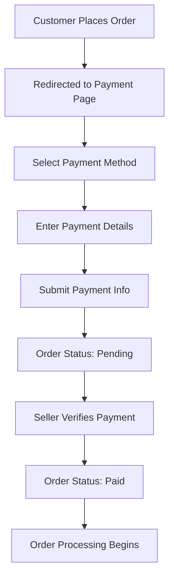

# 🛍️ FeriWala - Complete E-commerce Platform

<div align="center">


[](https://nextjs.org/)
[](https://reactjs.org/)
[](https://www.typescriptlang.org/)
[](https://nodejs.org/)
[](https://www.sqlite.org/)
[](https://tailwindcss.com/)

**A modern, full-stack e-commerce solution with customer shopping, seller management, and admin capabilities**

[🚀 Live Demo](#) • [📖 Documentation](#features) • [🔧 Installation](#installation) • [🤝 Contributing](#contributing)

</div>

---

## ✨ Features

### 🛒 **Customer Experience**
- 🎯 **Smart Product Discovery** - Advanced search with filtering and sorting
- 🛍️ **Seamless Shopping Cart** - Real-time cart management with stock validation
- 💳 **Multiple Payment Options** - bKash, Nagad, Rocket, Upay, Visa, MasterCard support
- 📱 **Responsive Design** - Optimized for all devices
- ⭐ **Product Reviews & Ratings** - Customer feedback system
- 🚚 **Order Tracking** - Real-time order status updates
- 🔐 **Secure Authentication** - Clerk-powered user management

### 🏪 **Seller Dashboard**
- 📊 **Analytics Dashboard** - Sales insights and product performance
- 📦 **Inventory Management** - Stock tracking and low-stock alerts  
- 🏷️ **Product Management** - Easy product listing with image uploads
- 📈 **Sales Tracking** - Revenue analytics and order management
- 🎨 **Brand Customization** - Shop branding and details
- 📋 **Order Processing** - Streamlined order fulfillment workflow

### 🔧 **Admin Panel**
- 👥 **User Management** - Customer and seller administration
- 📊 **Order Management** - Complete order lifecycle control
- 💰 **Payment Processing** - Payment verification and status updates
- 📈 **Business Analytics** - Platform-wide insights and reporting
- 🛡️ **Security Controls** - JWT authentication and role-based access

---

## 🏗️ Architecture

```
📦 FeriWala E-commerce Platform
├── 🖥️ client/          # Next.js Customer Frontend
├── 🎛️ admin/           # React Seller Dashboard  
├── 🔧 seller_admin/    # Vite Admin Token Generator
├── 🖧 server/          # Express.js Backend API
├── 📄 logs/            # Application Logs
└── 🗄️ Database/        # SQLite Database
```

### 🛠️ **Tech Stack**

| Component | Technology | Purpose |
|-----------|------------|---------|
| **Frontend** | Next.js 15 + TypeScript | Customer shopping interface |
| **Admin Panel** | Vite + React + TypeScript | Seller management dashboard |
| **Backend** | Node.js + Express | RESTful API server |
| **Database** | SQLite | Data persistence |
| **Authentication** | Clerk + JWT | User & seller auth |
| **Styling** | TailwindCSS + Chakra UI | Modern UI components |
| **File Upload** | Multer | Image handling |
| **State Management** | React Context | Cart & user state |

---

## 🚀 Quick Start

### Prerequisites
- Node.js 18+ 
- npm or yarn package manager

### Installation

1. **Clone the repository**
```bash
git clone https://github.com/yourusername/feriwala-ecommerce.git
cd feriwala-ecommerce
```

2. **Install dependencies**
```bash
# Install root dependencies
npm install

# Install client dependencies
cd client && npm install

# Install server dependencies  
cd ../server && npm install

# Install admin dependencies
cd ../admin && npm install
```

3. **Environment Configuration**

Create `.env.local` in the client directory:
```env
NEXT_PUBLIC_CLERK_PUBLISHABLE_KEY=your_clerk_publishable_key
CLERK_SECRET_KEY=your_clerk_secret_key
```

Create `.env` in the server directory:
```env
JWT_SECRET=your_jwt_secret_key
DB_PATH=./ecommerce.db
PORT=5000
```

4. **Start the application**

```bash
# Start backend server (Terminal 1)
cd server && npm run dev

# Start client application (Terminal 2)  
cd client && npm run dev

# Start admin panel (Terminal 3)
cd admin && npm run dev
```

5. **Access the applications**
- 🛍️ **Customer Store**: http://localhost:3001
- 🎛️ **Seller Dashboard**: http://localhost:5173
- 🖧 **API Server**: http://localhost:5000

---

## 📋 API Documentation

### 🔑 Authentication Endpoints
```http
POST /api/sellers/register    # Seller registration
POST /api/sellers/login       # Seller authentication
GET  /api/sellers/profile     # Get seller profile
```

### 🛍️ Product Endpoints
```http
GET    /api/products          # Get all products
GET    /api/products/:id      # Get product details
POST   /api/products          # Create product (seller only)
PUT    /api/products/:id      # Update product (seller only)
DELETE /api/products/:id      # Delete product (seller only)
```

### 📦 Order Endpoints
```http
POST   /api/orders            # Place new order
GET    /api/orders/:id        # Get order details
POST   /api/orders/:id/payment # Submit payment info
PATCH  /api/admin/orders/:id/status # Update order status (admin)
```

### ⭐ Review Endpoints
```http
POST   /api/reviews           # Add product review
GET    /api/reviews/product/:id # Get product reviews
PUT    /api/reviews/:id       # Update review
DELETE /api/reviews/:id       # Delete review
```

---

## 💾 Database Schema

### Key Tables
- **sellers** - Seller account information
- **products** - Product catalog with inventory
- **orders** - Customer order records
- **order_items** - Individual items within orders
- **reviews** - Product reviews and ratings
- **customers** - Customer information

---

## 🔄 Payment Flow



**Supported Payment Methods:**
- 💳 bKash, Nagad, Rocket, Upay
- 💎 Visa, MasterCard
- 🏦 Bank Transfer

---

## 📱 Screenshots

<div align="center">

### 🏠 Customer Homepage


### 🛒 Shopping Cart


### 📊 Seller Dashboard  


</div>

---

## 🗺️ Roadmap

- [ ] 📱 Mobile app development (React Native)
- [ ] 🔔 Real-time notifications (Socket.io)
- [ ] 📊 Advanced analytics dashboard
- [ ] 🌍 Multi-language support
- [ ] 📧 Email marketing integration
- [ ] 🤖 AI-powered product recommendations
- [ ] 🚚 Third-party shipping integration
- [ ] 💎 Subscription-based products

---

## 🤝 Contributing

We welcome contributions! Please see our [Contributing Guidelines](CONTRIBUTING.md) for details.

### Development Workflow
1. Fork the repository
2. Create a feature branch (`git checkout -b feature/AmazingFeature`)
3. Commit your changes (`git commit -m 'Add some AmazingFeature'`)
4. Push to the branch (`git push origin feature/AmazingFeature`)
5. Open a Pull Request

---

## 📄 License

This project is licensed under the MIT License - see the [LICENSE](LICENSE) file for details.

---

## 👥 Team & Support

<div align="center">

**Built with ❤️ by the FeriWala Team**

[](https://github.com/yourusername/feriwala-ecommerce/issues)
[](https://github.com/yourusername/feriwala-ecommerce/stargazers)
[](https://github.com/yourusername/feriwala-ecommerce/network)

### 📞 Get Help
- 🐛 **Issues**: [GitHub Issues](https://github.com/yourusername/feriwala-ecommerce/issues)  
- 💬 **Discussions**: [GitHub Discussions](https://github.com/yourusername/feriwala-ecommerce/discussions)
- 📧 **Email**: support@feriwala.com

---

**⭐ If you find this project useful, please give it a star!**

</div>
